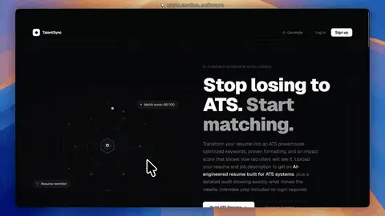

<div align="center">


# TalentSync

### AI powered resume analyzer, ATS optimizer, and interview question generator

</div>

---

## Overview

**TalentSync GenAI** is a full stack **MERN** application that helps job seekers improve their resumes using **Google Gemini AI**. The user uploads a resume and a target job description, and the system analyzes both, finds missing or weak skills, and generates an **ATS friendly PDF resume** along with **custom interview questions** based on the job role.

It is designed to act like a personal career assistant that removes the guesswork from resume tailoring.

---

## Demo



---

## Problem Statement

| Problem | Impact |
|---|---|
| Most resumes are not tailored to the job description | Get rejected by ATS systems before a human even sees them |
| Job seekers do not know which skills are missing | Apply blindly without improving weak areas |
| Manually rewriting a resume for every job is time consuming | Wastes hours that could be spent preparing for interviews |
| Interview prep is generic | Candidates are not ready for role specific questions |

TalentSync GenAI solves this by automating the comparison between resume and job description, then generating both a corrected resume and relevant interview questions in one workflow.

---

---

## Challenges Faced

| Challenge | Description |
|---|---|
| **Prompt accuracy with Gemini AI** | Getting consistent, structured responses from the AI required carefully designing prompts so the output could be parsed reliably instead of returning free form text. |
| **PDF generation formatting** | Converting AI generated resume content into a clean, ATS friendly PDF layout using Puppeteer needed a custom HTML template since direct text to PDF conversion looked unstructured. |
| **Handling AI response variability** | Gemini sometimes returned slightly different response formats, which required adding validation and fallback handling in the backend before sending data to the frontend. |
| **Authentication security** | Implementing JWT correctly so tokens expire properly and protected routes cannot be accessed without a valid token took careful testing. |
| **Connecting three layers smoothly** | Making sure React, Node.js, and MongoDB worked together without race conditions or broken async flows during file upload and AI processing. |

---

## What I Learned

| Skill | What I Gained |
|---|---|
| **Generative AI Integration** | Learned how to connect a real AI model (Gemini) into a production style app and structure prompts for reliable output |
| **MERN Stack Development** | Strengthened full stack development skills across MongoDB, Express style routing, React, and Node.js |
| **PDF Automation** | Learned how to use Puppeteer to programmatically generate styled PDF documents from dynamic content |
| **Authentication and Security** | Gained hands on experience implementing JWT based authentication and protecting backend routes |
| **API Design** | Learned to design clean REST APIs that connect frontend requests to AI processing and database storage |
| **Problem Solving Under Constraints** | Learned to debug inconsistent AI responses and build safeguards instead of assuming perfect output every time |

---

## How It Works

```
 ┌──────────────┐      ┌──────────────────┐      ┌────────────────────┐
 │  User Upload  │ ---> │   Gemini AI Core  │ ---> │   Result Engine     │
 │ Resume + Job  │      │  Analysis Layer   │      │  PDF + Questions     │
 └──────────────┘      └──────────────────┘      └────────────────────┘
```

1. **User uploads resume** and pastes the **job description**.
2. Backend (Node.js, vanilla JS, no framework like Express assumptions beyond what is used) sends both texts to the **Gemini AI API**.
3. Gemini analyzes the resume against the job description and returns:
   - Missing or weak skills
   - Suggested resume corrections
   - Relevant interview questions
4. The corrected, ATS optimized resume content is converted into a clean PDF using **Puppeteer**.
5. The user receives the downloadable PDF along with a list of likely interview questions for that role.
6. **JWT authentication** keeps each user session secure and keeps resume data private to the logged in user.

---

## Tech Stack

| Layer | Technology |
|---|---|
| Frontend | React.js |
| Backend | Node.js (vanilla JavaScript) |
| Database | MongoDB |
| AI Engine | Google Gemini AI |
| PDF Generation | Puppeteer |
| Authentication | JSON Web Tokens (JWT) |
| Styling | CSS |

---

## Architecture

| Component | Responsibility |
|---|---|
| **Frontend (React)** | Handles UI, resume upload form, job description input, displays AI results |
| **Backend (Node.js)** | Handles API routes, authentication, communicates with Gemini AI, manages PDF generation |
| **MongoDB** | Stores user accounts, resume history, and generated reports |
| **Gemini AI** | Performs resume to job description comparison and content generation |
| **Puppeteer** | Renders HTML resume templates into downloadable PDF files |
| **JWT Middleware** | Protects private routes and validates logged in users |

---

## Features

| Feature | Description |
|---|---|
| Resume vs Job Description Analysis | Finds gaps between candidate skills and job requirements |
| ATS Optimized PDF Resume | Auto generates a resume formatted to pass ATS filters |
| Interview Question Generator | Produces role specific interview questions using AI |
| Secure Authentication | JWT based login and signup system |
| Resume History | Stores past analyses for the logged in user |


## Installation

```bash
# Clone the repository
git clone https://github.com/qasim-mehar/talentsync-genai.git

# Move into the project folder
cd talentsync-genai

# Install backend dependencies
cd Backend
npm install

# Install frontend dependencies
cd ../Frontend
npm install
```

### Run the Backend

```bash
cd Backend
npm start
```

### Run the Frontend

```bash
cd Frontend
npm start
```

---

## Environment Variables

Create a `.env` file inside the **Backend** folder with the following keys.

| Variable | Purpose |
|---|---|
| `GEMINI_API_KEY` | Your Google Gemini API key |
| `MONGO_URI` | MongoDB connection string |
| `JWT_SECRET` | Secret key used to sign JWT tokens |
| `PORT` | Port number for the backend server |

---

## Project Structure

```
talentsync-genai/
│
├── Backend/
│   ├── routes/
│   ├── controllers/
│   ├── models/
│   ├── middleware/
│   └── server.js
│
├── Frontend/
│   ├── src/
│   │   ├── components/
│   │   ├── pages/
│   │   └── App.js
│
├── package.json
└── README.md
```

---

## Future Improvements

| Idea | Benefit |
|---|---|
| Resume scoring system | Give users a numeric ATS score before download |
| Multiple resume templates | Let users choose a design style for the PDF |
| Cover letter generator | Auto generate a matching cover letter |
| Multi language support | Support resumes in languages other than English |

---

## Author

**Qasim Mehar**

Project Repository: [talentsync-genai](https://github.com/qasim-mehar/talentsync-genai)